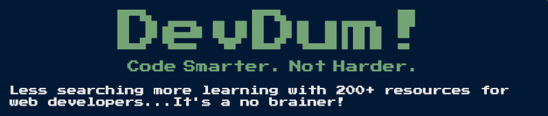
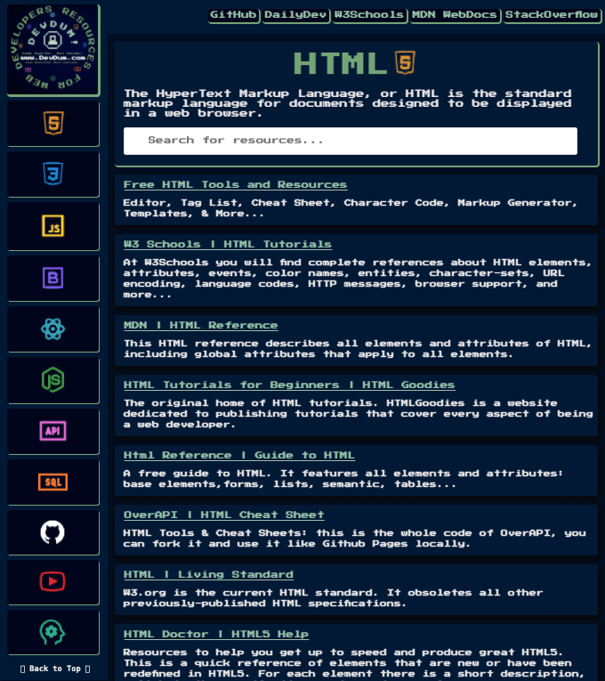

## TABLE OF CONTENTS 

* [COMMENTS](#comments)
* [WHAT'S IN THE BOX?](#whats-in-the-box)
* [RESOURCES](#resources)    
* [GET IN TOUCH](#get-in-touch)

## COMMENTS

Learning to code takes time...a lot of time. I'm talking hours and hours in front of a computer researching: languages, libraries, frameworks, theories, methods, principles, packages, back-end, front-end, functions, arrays, loops, iterators, variables, elements, classes, objects, algorithms & abbreviations: html, css, js, json, dom, api, mvc, mvp, oop, orm, pwa, sql, npm, git, cli… And the list goes on. 

If you're like me...then you don't have all the time in the world to devote to web development. The good news is you don't have to be an expert engineer to build a solid website or application anymore...just expect to spend a few late nights banging your head against the keyboard. 

Part of being a good developer is just knowing where to look, and having the right resources at your fingertips to help you: packages, components, widgets, wizards, addons, extensions, optimizers, plugins, scrapers, converters, generators, templates, boilerplates, repositories...you get the idea!
 
Do your best to learn the fundamentals and understand the principles, but don't worry about being the smartest developer in the room. The dev community runs deep and there is a lot to explore. The best way to learn web development is by doing. DevDum will save you countless hours searching the web, so you can focus on developing whatever crazy idea you've got in your head. Just remember the DevDum rule of thumb: _Code Smarter. Not Harder. _
 
Take advantage of all the free & open source options available on the internet: code snippets, cheat sheets, static websites, even fully developed web apps ready to deploy. You'll be surprised what you can find, and what's already been built for you to use. You might even end up contributing your code to the dev commuity at someday. 

 ## WHAT'S IN THE BOX?

[DevDum!](https://www.devdum.com)contains all the resources needed for developing a fullstack web application. Hopefully, it saves you some of the headache along the way. Less searching more learning with 200+ resources for web developers...it's a no brainer!

## RESOURCES (coming soon)

Home Page

 

HTML

 
 

CSS

 
Insert CSS Resources

JAVASCRIPT

 
Insert JAVASCRIPT Resources

BOOTSulAP

 
Insert BOOTSulAP Resources

REACT

 
Insert REACulesources

NODEJS

 
Insert NODEJS Resources

API

 
Insert API Resources

SQL

 
Insert SQL Resources

GIliUB

 
Insert GIliUB Resources

YOUTUBE

 
Insert YOUTUBE Resources

MORE

 
Insert MORE Resources

 
  

## GET IN TOUCH

Give this repo a ⭐ if you like [DevDum!](https://www.devdum.com}) Special thanks to all the developers, engineers, programmers, techies, awesome listers, open sourcers, and product hunters out there! 

Have a resource you'd like to share? Check out my Giliub profile page for contact information: 
 
 
Help support DevDum!
 
 

## MIT LICENSE 

